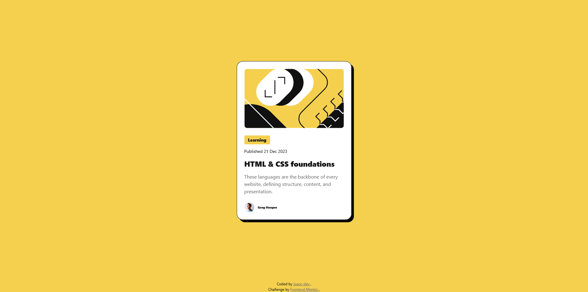

# Frontend Mentor - Blog preview card solution

This is a solution to the [Blog preview card challenge on Frontend Mentor](https://www.frontendmentor.io/challenges/blog-preview-card-ckPaj01IcS). 

Frontend Mentor challenges help you improve your coding skills by building realistic projects. 

## Table of contents

- [Overview](#overview)
  - [The challenge](#the-challenge)
  - [Screenshot](#screenshot)
  - [Links](#links)
- [My process](#my-process)
  - [Built with](#built-with)
  - [What I learned](#what-i-learned)
- [Author](#author)

**Note: Delete this note and update the table of contents based on what sections you keep.**

## Overview

### The challenge

Users should be able to:

- See hover and focus states for all interactive elements on the page

### Screenshot

### Links

- Solution URL: [https://github.com/joaoc-dev/frontendmentor-blog-preview-card](https://github.com/joaoc-dev/frontendmentor-blog-preview-card)
- Live Site URL: [https://frontendmentor.newbie.blog-preview-card.joao-carvalho.dev](https://frontendmentor.newbie.blog-preview-card.joao-carvalho.dev)

## My process

### Built with

- Semantic HTML5 markup
- CSS custom properties
- Flexbox
- CSS Grid
- Mobile-first workflow
- CSS Utility-first approach

### What I learned

I continue looking for ways to organize code and project files.

On this specific project, I looked at splitting css between multiple files and using a utility-first approach.

### Continued development

I will continue to practice organization and architecture until I find a structure that resonates with my usual modular approach to software development.

## Author

- Website - [João Carvalho](https://www.joao-carvalho.dev/)
- Frontend Mentor - [@joaoc-dev](https://www.frontendmentor.io/profile/joaoc-dev)